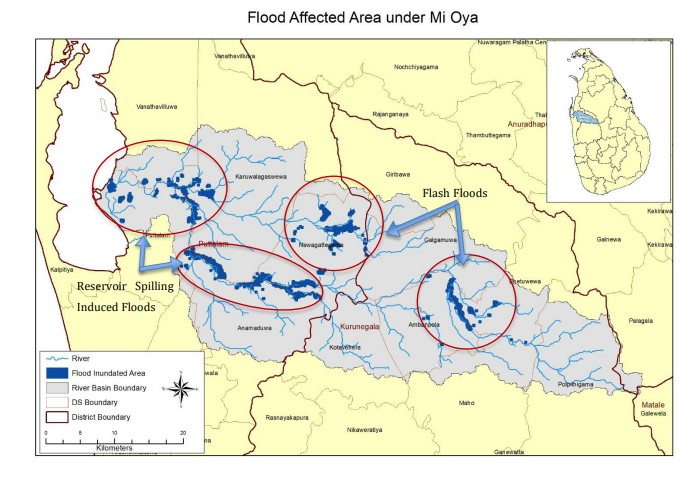
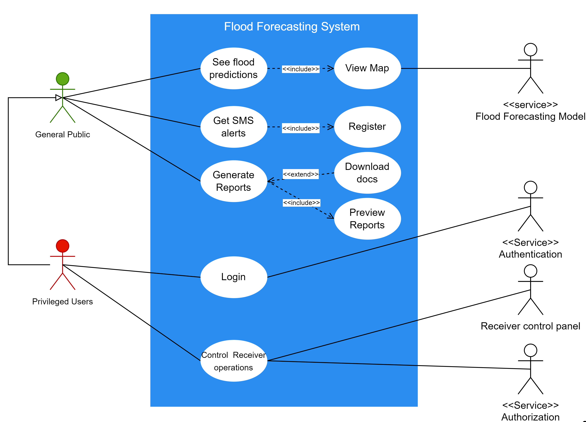
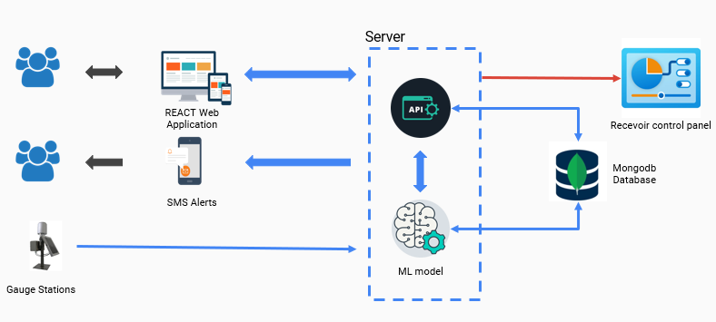
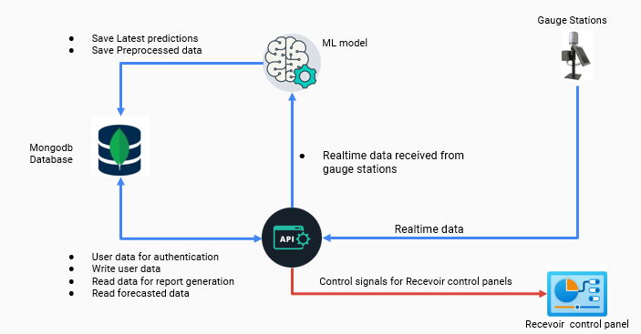
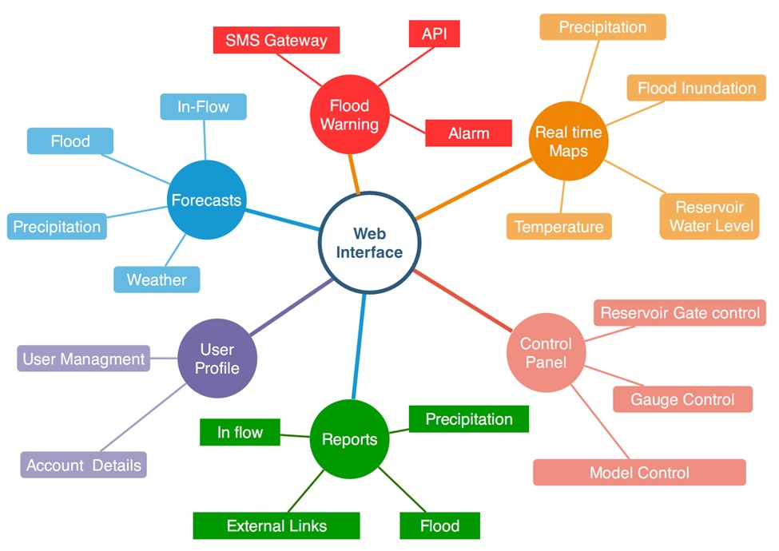

# Realtime Flood Forecasting System

## Table of content

[Overview](#Overview)

[Solution](#Solution)

[Solution Architecture](#Solution-Architecture)

[Team](#Team)

[Links](#Links)

---

## Overview

        Floods are the most destructive form of natural hazards in both 
        local and global context.This is true in terms of both loss of 
        life and property damage. Early flood forecasting can
        be used to identify potential areas of flooding in order to develop
        mitigatory planning and evacuation programs to remove people from 
        such areas during flooding and also to implement suitable preventive 
        measures to avoid damage to properties.

        In this project, our main objective is to build a flood forecasting 
        system for Mi Oya river basin(Sri Lanka).Mi Oya Basin is heavily 
        affected by seasonal flooding and droughts.

        As per the available data, floods in the Mi Oya basin are unleashed 
        due to river overflow and reservoir spilling. Out of the several 
        reservoirs located in the basin, Tabbowa and Inginimitiya are crucial 
        in worsening the flood impacts as these two reservoirs are
        frequently spilling under adverse weather conditions. As such, the 
        prevalence of a real-time flood forecasting model with the incorporation 
        of the reservoir operations for the entire basin is essential to 
        alleviate the flood induced impacts while preserving the optimum volume
        of water in the major reservoirs in the basin.

---

## Solution

        The proposed solution is to implement a simple data-driven or machine learning model to
        identify a direct mapping between the inputs(e.g., precipitation(P), temperature(T),
        potential evapotranspiration(PET), etc.) and outputs(In-flow level) without detailed
        consideration of the internal structure of the physical process. Also the system is
        consist of a web interface. The interface consists of three major modules as community
        view,control panel, and report. The warning messages are displayed with a map depicting
        the inundation extent in the community view, which is the interface for the public. Further,
        the community members are allowed to register their mobile numbers to receive warnings
        as SMS when such warnings are broadcasting at the disaster management center. A summary
        of past floods can be generated from the Report module for a required time period. Control
        panel provides access to the simulation module, gate operation module, flood warning
        dissemination module, access control module, etc. Only privileged users have access to the
        control panel. The figure below outlines the highlevel structure of the web application.

---

## Solution Architecture

### `Requirement Analysis`

| Functional Requirements                           | Nonfunctional Requirements |
| ------------------------------------------------- | -------------------------- |
| Forecast Floods and show critical regions in maps | Reliability                |
| Warn general public by SMS alerts                 | Scalability                |
| Generate flood reports                            | User experience            |
| Control reservoir operations                      | Security                   |

### `Usercase Diagram`

### `Highlevel System Overview`

### `Data and Control Flow`

### `Web Application Overview`

---

## Team

### Project Owner

Dr. Upul Jayasinghe, [upuljm@eng.pdn.ac.lk](mailto:upuljm@eng.pdn.ac.lk)

### Scrum Master

Imesh Udara Ekanayake, [imeshuek@eng.pdn.ac.lk](mailto:imeshuek@eng.pdn.ac.lk)

### Team members

E/17/006, ALAHAKOON A.M.H.H, [e17006@eng.pdn.ac.lk](mailto:e17006@eng.pdn.ac.lk)

E/17/176, KUMARA W.M.E.S.K, [e17176@eng.pdn.ac.lk](mailto:e17176@eng.pdn.ac.lk)

E/17/338, SRIMAL R.M.L.C, [e17338@eng.pdn.ac.lk](mailto:e17338@eng.pdn.ac.lk)

---

## Links

[Project Repository](https://github.com/cepdnaclk/e17-co328-Flood-Forecasting-System)

[Project Page](https://cepdnaclk.github.io/e17-co328-Flood-Forecasting-System/)

[Department of Computer Engineering](http://www.ce.pdn.ac.lk/)

[University of Peradeniya](https://eng.pdn.ac.lk/)

---

